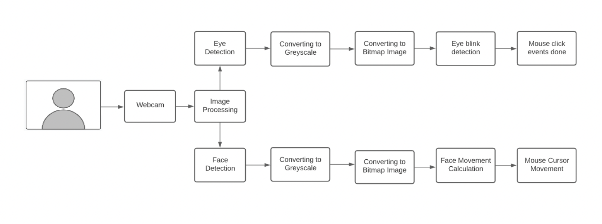
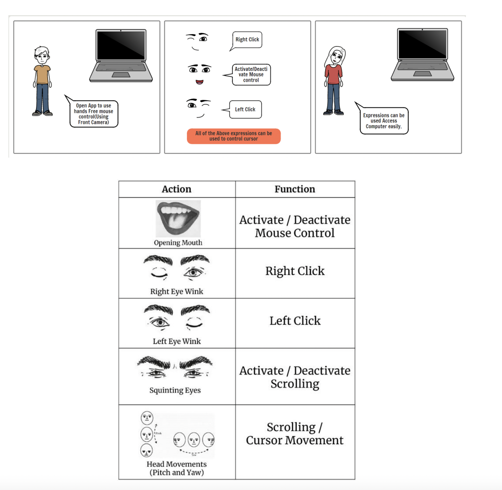
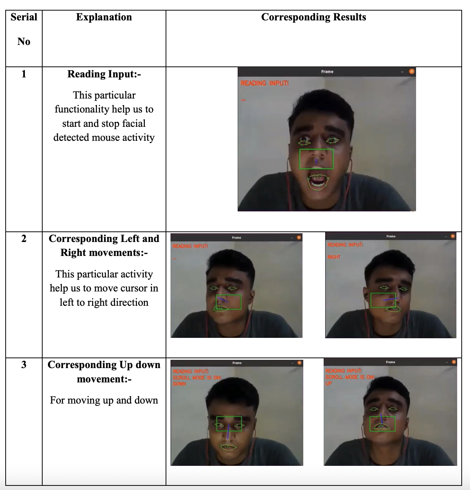
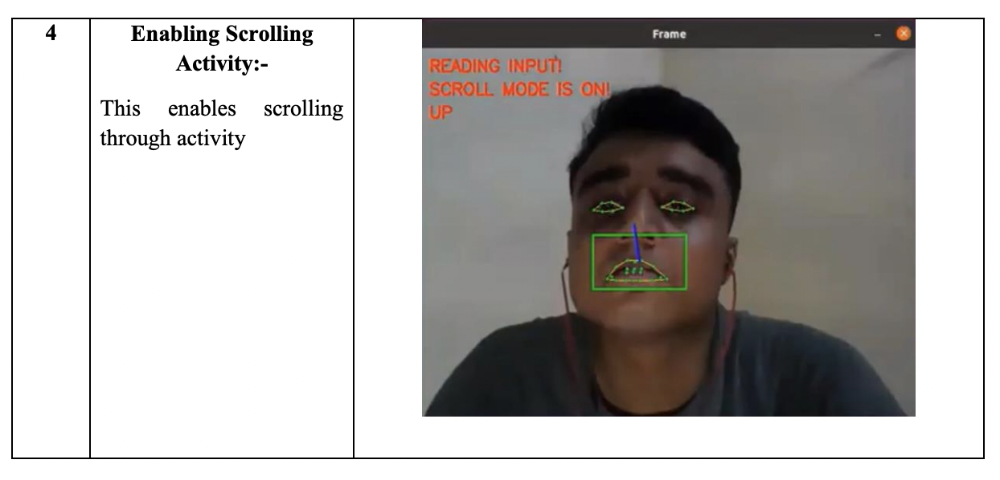

# Mouse Cursor Control Using Facial Movements -----> HandiCont

This HCI (Human-Computer Interaction) application in Python(3.6) will allow you to control your mouse cursor with your facial movements, works with just your 
regular webcam. Its hands-free, no wearable hardware or sensors needed.

# Our System Explanation

Our system is real time which captures a movement of mouse cursor through face detection and facial features. It overcomes the existing system by avoiding the use 
of external hardware that caused serious eye damages. It uses a template matching method for eye extraction instead of using hardware, even as in previous system 
the short blinks of eyes were avoided or neglected. In this system the hard blink is only used for selecting particular file or folder .With eye detection it’s 
first aim is to captured face for the movement of mouse cursor. Then it reacts as the mouse does.

Goal of the system :

1. Hands-free mouse controlling
2. To establish vision based system
3. Controlling mouse motions using facial gesture
4. To eliminating the limitations of stationary head
5. To provide real time eye tracking

# Software Used
1. Python (>= v3.5)
2. NumPy (>= v1.11.0)
3. SciPy (>= v0.17.0)
4. joblib (>= v0.11)
5. scikit-learn
6. Pandas

## Execution
Order of Execution is as follows:

1. Follow these installation guides - [Numpy](https://pypi.org/project/numpy/), [OpenCV](https://medium.com/@akshaychandra21/f5f721f0d0b3), [PyAutoGUI](https://pyautogui.readthedocs.io/en/latest/install.html), [Dlib](https://www.learnopencv.com/install-opencv-3-and-dlib-on-windows-python-only/), [Imutils](https://github.com/jrosebr1/imutils) and install the right versions of the libraries (mentioned above).
2. Make sure you have the model downloaded. Read the README.txt file inside the model folder for the link. 
3. `python mouse-cursor-control.py`

Please raise an issue in case of any errors. 

# Architecture Diagram

# Story Boarding

# Future Planning of UI

# Contributors
<a href = "https://github.com/ISHITVAVERMA">1. Ishitva Verma </a> 
<a href = "https://github.com/Akash708231">2. Akash Butar </a> 

# Output

	Made with :heart:

